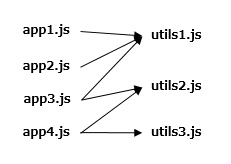

# code-splitting

## ファイル分割がなぜ必要なのか

最初にファイル分割しないアプリケーションのケースを考えてみましょう。

アプリケーションの一番最初のエントリーポイントとなる `index.js` は次のように複数のアプリケーションをインポートしています。

```js
import app1 from './app1';
import app2 from './app2';
import app3 from './app3';
import app4 from './app4';
```


個々のアプリケーションはユーザーの操作によって切り替えられるので、本来なら切り替えられるまで対象のアプリケーションをロードする必要はありません。


ただしこれを普通にwebpackすると、次のようにすべてのアプリケーションがバンドルされた巨大な `index.bundle.js` が生成されてしまいます。


これにより、初期ロード時に必要なアプリケーション以外もすべてロードされることになり、ロード時間が大幅にかかってしまします。

このような理由から、ファイルを分割してロードする必要があります。


## どのようにファイル分割するか

では実際にファイル分割の実装をおこなっていきましょう。

### ユーザーの操作によってアプリケーションを切り替える

アプリケーションの一番最初のエントリーポイントとなる `index.js` ですべてのアプリケーションをインポートしてしまうと、1つの巨大なバンドルファイルができあがってしまいます。

そこで、各アプリケーションを個々のファイルとしてバンドルし、`index.js` ではアプリケーションをインポートせずに、ユーザーの操作によって対象のアプリケーションをロードするようにしましょう。

まずは各アプリケーションを個々のファイルとしてバンドルします。次のような `webpack.config.js` を用意し、webpackを実行します。

```js
const path = require('path');
const webpack = require('webpack');

module.exports = {
  entry: {
    index: './src/index.js',
    app1: './src/app1.js',
    app2: './src/app2.js',
    app3: './src/app3.js',
    app4: './src/app4.js',
  },
  output: {
    filename: '[name].bundle.js',
    path: path.resolve(__dirname, 'public')
  }
};
```

実行結果としてアプリケーションが個別にバンドルされた次のようなファイルが生成されます。


個別にバンドルされたアプリケーションはユーザー操作によって切り替える必要があります。これについては、`index.js` に次のようなメソッドを用意し、ユーザー操作のイベントの中で呼び出すようにします。

```js
function loadApp(appName) {
  const script = document.createElement('script');
  script.onload = () => {
    console.log(`${appName} loaded`);
  };
  script.src = `${appName}.bundle.js`;
  document.head.appendChild(script);
}
```

ここまででユーザー操作によってアプリケーションを切り替えることができるようになりました。これで初期ロードにかかる時間を短縮でます。ただしまだ最適化すべき点が残っています。次の項ではこれについて説明します。


### 複数箇所で利用されている共通モジュールを抜き出す

一般的なアプリケーションは複数のベンダーライブラリや自作ライブラリをインポートして使用します。今回のアプリケーションも同様に複数のライブラリをインポートしています。

ただし現状は、複数のアプリケーションが共通的に利用するライブラリであっても個々のアプリケーションにバンドルされています。

各アプリケーションは、次のようにモジュールをインポートしています。



例として `app3.js` のソースファイルからインポートしている箇所を抜粋します。

```js
import utils1 from './utils1';
import utils2 from './utils2';
```

上図をみると、`utils1.js` は3箇所から、`utils2.js` は2箇所からインポートされています。ここでは3箇所からインポートされている `utils1.js` を `common.bundle.js` というファイルにバンドルして参照するようにしていきましょう。

先程作成した `webpack.config.js` に追記をおこない、webpackを実行します。

```js
module.exports = {
  entry: {
    …
  },
+ plugins: [
+   new webpack.optimize.CommonsChunkPlugin({
+     // チャンクの名前を指定
+     // 例: "common"を指定した場合、下記｢output｣の設定により"common.bundle.js"というファイル名になる
+     name: 'common',
+     // チャンクへモジュールを移動する基準となる最小インポート数
+     // 例: ｢3｣を指定した場合、3箇所からインポートされているモジュールがチャンクへ移動される
+     minChunks: 3,
+   }),
+ ],
  output: {
    filename: '[name].bundle.js',
    …
  }
};
```

結果として次のようなバンドルファイルが作成されます。`minChunks: 3` なので3箇所からインポートされている `utils1.js` のみが `common.bundle.js` にバンドルされ、それ以外の `utils2.js` と `utils3.js` はバンドルされません。

仮に `minChunks: 2` と設定した場合、`utils1.js` と `utils2.js` が `common.bundle.js` にバンドルされることになります。


ここまででバンドルファイルは作成されましたが、`common.bundle.js` はwebpackの実行によって作成されたファイルであり、webpackを実行する前には存在しなかったファイルです。つまりどこからもインポートされていないのでまだ使用できる状態にはありません。ここでは次のように `index.html` の `script` タグでロードして使用できるようにします。

```html
<head>
  …
  <script src="common.bundle.js"></script>
  …
</head>
```


## 動かしてみよう

### 環境構築

yarnをインストールします。

```console
$ npm install -g yarn
```

プロジェクトの依存パッケージをインストールします。

```console
$ yarn install
```

### バンドルファイルの作成

次のコマンドでwebpackが実行され、バンドルファイルが作成されます。

```console
$ yarn build
```


### ユーザー操作によってアプリケーションを切り替える

次のコマンドでローカルサーバーを起動します。

```console
$ yarn serve
```

起動したらブラウザで http://localhost:5000/index.html にアクセスします。次のような画面が表示されるのでセレクトボックスの選択を変更することでアプリケーションを切り替えることができます。

アプリケーションを切り替えてブラウザの開発者ツールのコンソールやネットワークで状態を確認してみてください。


